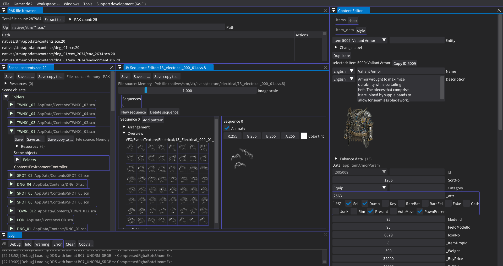

# REE Content Editor
Desktop tool for editing and partial patching the files of all RE ENGINE titles, the next evolution of [DD2 ingame Content Editor](https://github.com/kagenocookie/dd2-content-editor). The project is based on [REE-Lib](https://github.com/kagenocookie/RE-Engine-Lib) for file editing and an ImGui.NET-based UI with full 2D and 3D graphics capabilities. It can provide most functionality needed for mod development.

Besides basic file editing, the tool is able to merge multiple changes to the same file with autogenerated JSON + file "bundles", allowing easy modification of content even when shared catalog files need to be modified by multiple mods. This can also make upgrading data easier after game updates break files with no major structural differences (which is most of the time). The patcher can emit the patched files either directly into the natives folder or into a patch PAK file.

## Supported games
- All mainline Resident Evil games
- Dragon's Dogma 2
- Devil May Cry 5

Some files may not fully work for other RE ENGINE games.

## Setup
- Install the .NET 8 runtime (https://dotnet.microsoft.com/en-us/download/dotnet/8.0)
- Download the latest [release](https://github.com/kagenocookie/REE-Content-Editor/releases) or [debug](https://github.com/kagenocookie/REE-Content-Editor/actions) build
- Launch `ContentEditor.App.exe`
- Usage guides are available on [the wiki](https://github.com/kagenocookie/REE-Content-Editor/wiki), these will be updated as new features are added and improved

## Development setup
- Clone the repository
- `git submodule init`
- `git submodule update`
- Use the `net8.0-windows` target to make native file dialogs work
- Build with `dotnet build` or whichever C#-capable IDE's build features (vscode, VS)

## Features
- Most common files are supported for viewing and editing
- 3D view for all supported meshes, scene and prefab files (via the "Scenes" menu after compatible files are opened)
- Preview any 3D animation through the mesh viewer
- Load files directly from the PAK files, meaning you can just access whatever you need without having to extract everything first
- Data search tool for easily finding things you might need for mod development: find messages by their guids or content, or arbitrary fields by their value
- Partial patching of files in case multiple mods would need to modify the same shared file (e.g. content catalog files)
- Streamlined editors for game-specific content (these need to be researched and set up per game so the feature may not be available for all games - mostly configurable through yaml files)
- Full undo/redo system

### File support table

| File type | Basic support | Additional features |
| --------- | ------- | ---------------- |
| .pak      | ☑️ read/create | Direct file access, file extraction
| .user     | ☑️ read/write | Partial patching individual fields
| .pfb      | ☑️ read/write | Partial patching individual fields, 3D preview
| .scn      | ☑️ read/write | Partial patching individual fields, 3D preview
| .msg      | ☑️ read/write | Partial patching individual translations
| .uvs      | ☑️ read/write | Animation preview
| .uvar     | ☑️ read/write
| .mdf2     | ☑️ read/write
| .efx      | ☑️ read/write
| .tex, .dds  | view, convert  | Convert to TGA/PNG
| .mesh     | ☑️ 3D & data display | FBX & GLTF export/import Format conversion across games
| .motlist  | ☑️ read/write | Animation preview GLTF import/export Mot copy/paste/retargeting ([info](https://github.com/kagenocookie/REE-Content-Editor/wiki/Animation-tools))
| .rcol     | read/write | 3D shape preview and editing
| .motbank  | read/write
| .mcol     | ☑️ read/write | .glb import/export for collision mesh
| .ainvm    | raw data read
| .cdef, .def | ☑️ read/write
| common image formats | view only
| common mesh formats | ☑️ 3D display | Convert to RE mesh
| many other misc files | raw data read/write

*File types marked with ☑️ are effectively feature complete for most usecases.*

## Custom entity support
Accessible under the Windows > Entities menu option for supported games, these are streamlined editors for game-specific data. They can be used to more easily modify or add custom items and other game content related objects.

## Game-specific additional support

### Dragon's Dogma 2

Field scene streaming is supported through the `natives/stm/appdata/maincontents.scn.20` file while the `Field` folder is active. The open world scenes should load and unload based on the camera position.

For any spawn related data editing, my [anatomically accurate map](https://kagenocookie.github.io/dd2map/) can be used as a reference for grid cells and positions

#### Custom entities:
- Shop modifications
- Custom basic items and weapons (TODO: armors)
- Weather parameters
- NPC appearance and costume parameters
- Events
- Quest data (partial)
- Job and skill metadata

### Resident Evil 2 (RT), 3 (RT), 4, 8
- Basic weapon data entities

## Structure
The project consists of several individual modules.

#### Content Editor Core
The core content editor features for bundle management are in here. This could eventually serve as a base for a .NET port for an ingame editor once the REFramework C# API stabilizes.

#### Content Editor App
Serves as both a general resource editing tool, while also providing specialized and streamlined YAML-configurable functionality for some objects.

#### Content Patcher
Contains tools for evaluating, generating, and applying resource file patches. Can be used as a CLI tool for only updating patches without any of the UI overhead.

## Patching architecture
All the patching logic is based on 3 layers of modifications: files, resource objects and entities, each built on top of the previous layers.

- Files represent the individual .user, .msg, .pfb, etc files, identified by their filepath. Every editable file goes under this layer.
- Resource objects are individual unique objects within one or multiple files. These always support partial patching.
- Entities group together multiple resources into one logical and more easily digestable unit. These allow "Content Editor" style centralized editing of data.

Patchable resources and entities are defined in `configs/<game>/definitions/*.yaml` files, intended to be easily extendable without modifying the code based on predefined patcher methods.

There are some cases where doing a full overwrite of files may be required because the patch generation can't reliably detect some types of changes. You can mark a file as `"replace": true` in the bundle json file for those cases, which will fully replace the files instead of doing partial patching.
- Removal of objects may not always get detected correctly or just not handled at all
- Inserting new elements in the middle of an array or reordering them may not always interact correctly with multiple mods. Adding elements at the end is perfectly fine, and the app generally only lets you do that.
- Renaming existing GameObjects or folders may not work as expected because the pfb/scn patching relies on consistent names

***Resource object***

Represents a single uniquely identifiable "object". This can be anything from an individual translation message entry, an item's base data / icon / name / description field, or a quest name / summary / log entry / condition set / etc...

A resource needs to be individually editable, it can be either a whole file, or a single object within the file, or possibly an object that doesn't have a specific file (multiple potential files) but is still stored in exactly one place.

***Entity***

An entity is, effectively, a group of resources. In the case of an item, it would contain all the individual resources needed for an item to work - name and description message, icon, base data, enhance requirements, crafting combinations, ...

Each entity needs to have a unique integer (int64) ID. Where possible, this is directly equivalent to the game IDs, but where those aren't available, can be a hashed combination of fields (e.g. a GUID or multiple fields hashed together into an integer).

***Bundle***

A bundle can contain any number of data modifications, effectively describes a single "mod" or "patch". There is always the bundle.json file containing all information on what it changes and how. Can also contain any number of raw modified files, linked to by the resource_listing field of the bundle json, to tell the patcher where to place the file and if it should be a full replacement or a partial patch.

One bundle modifying the same file as a direct file and through entities at the same time is "undefined" and may or may not work as expected. During the patching process, direct file modifications are processed before entities within the individual bundle.

## Contributing
Pull requests are welcome. There are several open issues for bigger features for anyone interested in helping, but if you feel like anything else could be improved upon, feel free to make a feature request or contribute yourself. I'm willing to assist with pointers regarding implementation details.

## Credits
- Everyone who contributed to or was acknowledged in [RE-Engine-Lib](https://github.com/kagenocookie/RE-Engine-Lib)
- alphaZomega: mot bone remapping configs for re2 and re3

## Disclaimer
This project is in no way affiliated with, endorsed by, or connected to RE ENGINE, Capcom, or any of their affiliates. All trademarks are the property of their respective owners.
